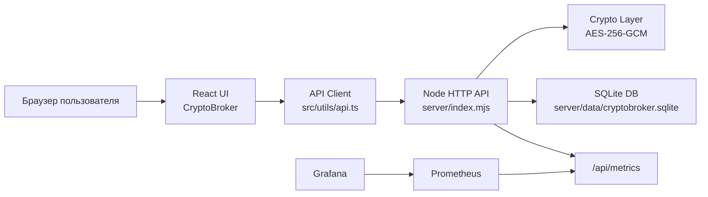
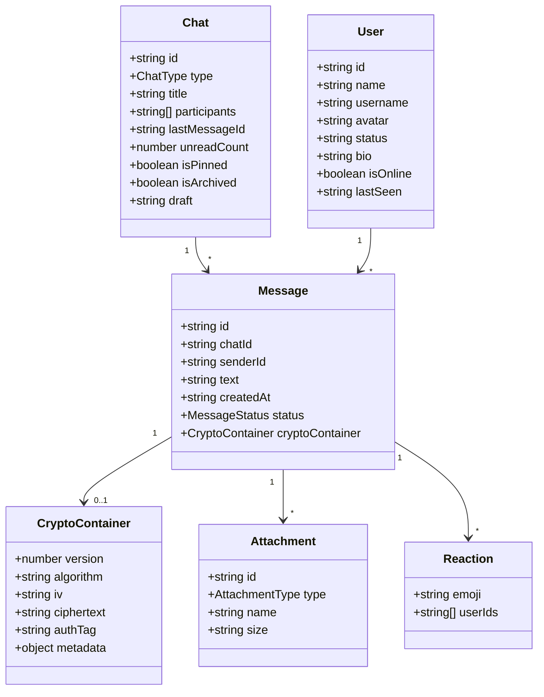
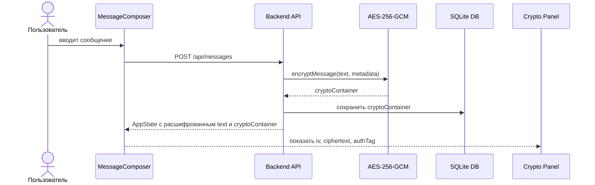
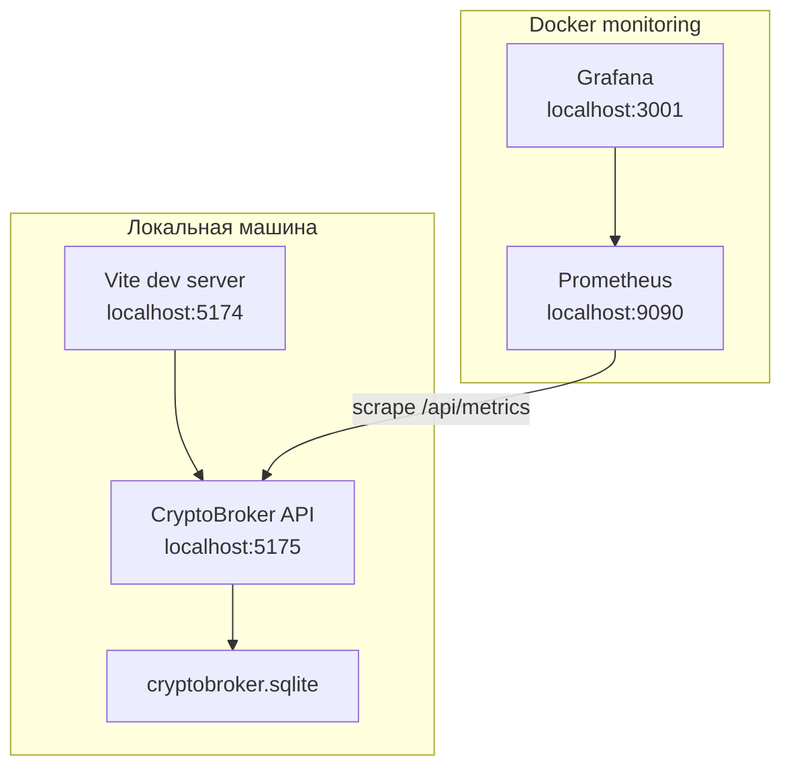

# CryptoBrokerWeb: архитектура, UML, Grafana и паттерны

## Назначение

CryptoBrokerWeb - локальный веб-мессенджер с отдельным frontend, backend API, SQLite-базой данных и криптографической защитой новых сообщений. Пользователи регистрируются по username и паролю, находят друг друга по username, создают личные чаты и обмениваются сообщениями.

## Компонентная UML-диаграмма



## Диаграмма классов / моделей данных



## Sequence: отправка защищенного сообщения



## Deployment-диаграмма



## Grafana

Backend отдает метрики:

```text
GET http://localhost:5175/api/metrics
```

Основные метрики:

- `cryptobroker_users_total`
- `cryptobroker_chats_total`
- `cryptobroker_messages_total`
- `cryptobroker_sessions_total`

## Использованные паттерны проектирования

| Паттерн | Где используется | Зачем |
|---|---|---|
| Component | `src/components/*` | UI разделен на независимые компоненты |
| Container / Presentational | `App.tsx` + компоненты | `App` хранит состояние, компоненты отображают данные |
| Facade | `src/utils/api.ts` | frontend работает с API через один слой |
| Repository | `server/index.mjs`: `readDb/writeDb` | доступ к базе изолирован от маршрутов |
| DTO | ответы `AppState`, `AuthPayload` | backend отдает frontend только нужные данные |
| Adapter | `api.ts` адаптирует HTTP к функциям UI | компоненты не знают детали `fetch` |
| Observer / Polling | автообновление `GET /api/state` | клиент получает новые сообщения |
| Strategy | шифрование AES-256-GCM и фильтры чатов | разные стратегии обработки можно менять отдельно |
| Factory Method | `makeId`, создание `Chat`, `Message`, `CryptoContainer` | единый способ создавать сущности |
| Proxy | Vite proxy `/api -> localhost:5175` | frontend обращается к API без ручного CORS-адреса |

## Security by design

- Пароли не хранятся открытым текстом.
- PBKDF2 выполняется на backend.
- Новые сообщения сохраняются как AES-256-GCM криптоконтейнеры.
- Frontend получает публичную модель пользователя без `passwordHash` и `passwordSalt`.
- Доступ к `/api/state`, чатам и сообщениям требует Bearer-token.
- Пользователь видит только те чаты, где он является участником.
- Grafana и Prometheus вынесены в отдельный monitoring-контур.
